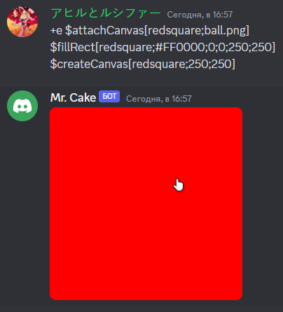

Draws a new rect.

## Usage

```
$fillRect[canvas;style;x?;y?;width?;height?;radius?]
```

## Parameters

| Field  | Description              | Type                         | Required |
| ------ | ------------------------ | ---------------------------- | -------- |
| canvas | The canvas name.         | string                       | true     |
| style  | The rect style.          | color \| gradient \| pattern | true     |
| x      | The rect X position.     | number                       | false    |
| y      | The rect Y position.     | number                       | false    |
| width  | The rect width.          | number                       | false    |
| height | The rect height.         | number                       | false    |
| radius | The rect corners radius. | number \| number[]           | false    |

## Example(s)

### This will draw a 250x250 red square

```
$attachCanvas[redsquare;ball.png]
$fillRect[redsquare;#FF0000;0;0;250;250]
$createCanvas[redsquare;250;250]
```



### This will draw a 250x250 red circle

```
$attachCanvas[redball;ball.png]
$fillRect[redball;#FF0000;0;0;250;250;125]
$createCanvas[redball;250;250]
```


